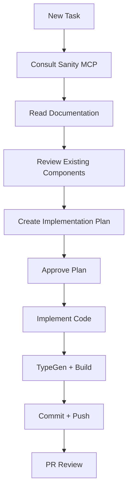

# {{PROJECT_NAME}} - Claude Code Instructions

Modern stack with **Sanity CMS**, **Next.js (App Router)**, and **Tailwind CSS**.

## 📚 Sanity CMS - Fuente Única de Verdad (CRITICAL)

**DIRECTIVA:** Para CUALQUIER tema relacionado con Sanity (schemas, queries GROQ, configuración, plugins, Visual Editing, APIs, best practices, troubleshooting), Claude DEBE consultar primero la documentación oficial completa:

> **URL:** https://www.sanity.io/docs/llms-full.txt

**Cuándo consultar:**
- Antes de crear o modificar schemas
- Antes de escribir queries GROQ
- Al configurar cliente Sanity, plugins o integraciones
- Al resolver errores relacionados con Sanity
- Al implementar features como Visual Editing, webhooks, CDN, image pipeline
- Al migrar contenido o configurar Sanity Studio

**Cómo usar:** Fetch la URL con `WebFetch` y buscar la sección relevante antes de implementar.

## 🚀 Quick Start

1. **Clone and Setup**:
   ```bash
   git clone <your-repo>
   cd <your-repo>
   npm install
   ```

2. **Configure Environment Variables**:
   Create `.env.local` in `next-app/` based on `.env.local.example`.

3. **Activate Sanity MCP in Claude Code** (for real-time content access):
   - Open Claude Code
   - Cmd/Ctrl + Shift + P → "Configure MCP Servers"
   - Add Sanity server from `.claude/mcp-servers.json`
   - Restart Claude Code
   - See: `doc/MCP-SANITY-SETUP.md` for details

4. **Run Development**:
   ```bash
   npm run dev
   ```
   - Frontend: `http://localhost:3000`
   - Sanity Studio: `http://localhost:3333`

## 🛠 Project Structure

- `/next-app`: Main Next.js application
- `/studio`: Sanity CMS dashboard
- `/docs`: Master documentation and setup guides
- `/.claude`: Claude Code workflows and settings

## 🤖 AI Workflow with Claude Code

### Work Protocol

**IMPORTANT**: Before any implementation, Claude must:

1. **Consult Sanity MCP** (if configured): Verify schemas and existing content
2. **Read Documentation**: Review project docs for standards
3. **Create Implementation Plan**: Generate plan with references
4. **Wait for Approval**: Don't write code until plan is confirmed

**SESSION DIRECTIVE (CRITICAL)**:
- 📝 **Save progress every 5 minutes** in session logs
- Include: changes made, files modified, keywords/objectives covered
- Format: Dated session with summary impact table
- Purpose: Persist context between sessions

**MEMORY LOG DIRECTIVE (CRITICAL)**:
- 📋 **Al finalizar cada fase, tarea o paso:** Actualizar `/doc/PHASE-PROGRESS.md`
- **Flujo obligatorio:**
  1. Consultar primero `CLAUDE.md` (directivas principales)
  2. Guardar TODA la información de cada paso en `PHASE-PROGRESS.md`
- **Registrar:** Cada documento nuevo, cada tarea finalizada, cada fase completada, cada paso del proceso
- **Propósito:** Mantener contexto persistente entre sesiones y permitir retomar trabajo exactamente donde se dejó
- **Ubicación:** `/doc/PHASE-PROGRESS.md` (centralizado con toda la documentación)
- **Plan de migración:** `/doc/MIGRATION-PLAN.md` (referencia principal del proyecto)
- **Índice:** `/doc/README.md` (guía de la estructura del proyecto)

**MEMORIA PERSISTENTE (CRITICAL)**:
- 🧠 Cuando el usuario diga **"memory"**, **"memoria"** o **"guarda memoria"**: guardar en `/doc/memory/`
- **Ubicación:** `/doc/memory/` (dentro del proyecto, versionado con git)
- **Archivos:**
  - `MEMORY.md` — Estado general, preferencias del usuario, siguiente paso
  - `architecture.md` — Estructura de archivos, rutas, design tokens
  - `audit-notes.md` — Hallazgos de auditorías, fixes aplicados
  - Crear archivos adicionales por tema si es necesario
- **NO usar** la carpeta `.claude/projects/.../memory/` del sistema — usar SOLO `/doc/memory/`

### 🔄 3-Phase Model Workflow (CRITICAL)

**DIRECTIVA:** Todo proyecto nuevo sigue un flujo de 3 fases con modelos específicos.
El documento `doc/memory/phase-handoff.md` es la **memoria persistente** entre fases.

| Fase | Modelo | Comando | Propósito |
|------|--------|---------|-----------|
| 1 | **Haiku** | `/model haiku` | Análisis completo del código y proyecto |
| 2 | **Opus** | `/model opus` | Planificación y diseño del plan de desarrollo |
| 3 | **Sonnet** | `/model sonnet` | Implementación del plan |

**Protocolo obligatorio entre fases:**
1. La fase actual **DEBE escribir** su sección en `doc/memory/phase-handoff.md`
2. La fase actual **DEBE mostrar** el mensaje de transición con instrucciones
3. La siguiente fase **DEBE leer** `doc/memory/phase-handoff.md` antes de trabajar
4. **NUNCA reinvestigar** lo que ya documentó una fase anterior

**Recomendación inteligente de modelos (OBLIGATORIO):**
- Al inicio de CADA tarea, Claude DEBE recomendar qué modelo usar en cada fase
- La recomendación se basa en tipo de tarea (ver matriz en `model-phases.md`)
- No toda tarea necesita 3 fases — tareas simples pueden usar 1-2 fases
- Mostrar recomendación con justificación y esperar aprobación del usuario

**Referencia completa:** `.claude/workflows/model-phases.md`

### Automated Workflows

Workflows in `.claude/workflows/` guide each process:

- **model-phases.md**: 3-Phase workflow (Haiku→Opus→Sonnet) with memory handoff
- **git-setup.md**: Structured and safe Git operations (3 modes)
- **development-standard.md**: Standards for implementation plans

#### Development Standard (Summary)
Before creating any implementation plan:
1. **Consult Sanity MCP** first (if available)
2. **Read project documentation** for best practices
3. **Include `## Documentation & Reference`** section with relevant links
4. **Verify stack**: Next.js App Router + Sanity CMS + Tailwind CSS
5. **Ultra-concise plans** (sacrifice grammar if it saves space)
6. **Create task list** at the end of the plan

### 🔄 Automatic Git Workflow (CRITICAL)

**IMPORTANT**: Claude must automatically execute Git workflow when changes are detected.

#### Claude's Automatic Behavior

When Claude detects repository changes (`git status` not empty):

1. **Analyze changes** and generate smart commit message (Conventional Commits)
2. **Ask ONCE**: *"I detected pending changes. Execute complete Git workflow?"*
3. **If user says YES**: Automatically execute entire flow without more questions:
   - ✅ Commit on `development` with smart message
   - ✅ Push to `origin/development`
   - ✅ Ask: *"Merge to main (production)?"*
   - ✅ If approved: Merge to `main` → Push → Return to `development`

#### Golden Rules

- 🚫 **NEVER edit directly on `main`** (protected production branch)
- ✅ **ALL changes start on `development`** (daily work branch)
- ✅ **Merge to `main` requires explicit user approval**
- ✅ **Always return to `development` when finished**

#### Complete Reference Document

For complete workflow details (3 modes: Setup, Smart Commit, Branch Workflow):
👉 `.claude/workflows/git-setup.md`

---

### Useful Commands

```bash
# Development
npm run dev                 # Start development (Next.js + Sanity Studio)
npm run build              # Production build
npm run type-check         # TypeScript type checking

# Sanity
cd studio && npx sanity typegen generate  # Generate TypeScript types
cd studio && npx sanity deploy           # Deploy Sanity Studio

# Testing
npm run lint               # Linting
npm test                   # Tests (if configured)
```

### Claude Code Specific Features

- **MCP Integration**: Direct access to Sanity MCP for real-time queries (if configured)
- **Context Awareness**: Full access to project context and documentation
- **Automated Workflows**: Automatic following of defined workflows

## ⚡ Best Practices

### 1. AI-Assisted Development

- **Start with MCP**: Consult Sanity MCP before any schema or content changes (if available)
- **Concise Plans**: Implementation plans should be ultra-concise
- **Context-First**: Read relevant documentation before proposing solutions

### 2. Architecture and Code

- **Mobile First**: Responsive designs from the start
- **Atomic Design**: Modular components (atoms → molecules → organisms)
- **Tailwind First**: Use utility classes. Avoid custom CSS except when necessary
- **TypeScript Strict**: Generate types with `sanity typegen generate`
- **Reusability**: Check existing components before creating new ones

### 3. Sanity CMS

- **Visual Editing**: Enable `@sanity/visual-editing` for new schemas (if using)
- **GROQ Queries**: Optimize queries. Use projection to limit data
- **Portable Text**: Use for rich multi-channel content
- **Asset Pipeline**: Leverage Sanity CDN with on-the-fly transformations
- **TypeGen**: Regenerate types after schema changes

### 4. Performance

- **ISR (Incremental Static Regeneration)**: Use for semi-static content
- **Edge Runtime**: Consider Edge for critical pages
- **Image Optimization**: Use `next/image` with Sanity Image Pipeline
- **Code Splitting**: Lazy load heavy components
- **Caching**: Implement cache strategies in GROQ queries

### 5. Git & Deploy

- **Descriptive Commits**: Format: `feat/fix/docs: concise description`
- **Descriptive Branches**: Prefix `feat/`, `fix/`, `chore/` by type
- **PR Reviews**: Include screenshots for visual changes
- **CI/CD**: Auto-deploy on push to `main`
- **Environment Variables**: Never commit `.env` files

### 6. Security

- **RBAC**: Role-Based Access Control in Sanity Studio
- **Env Vars**: Use environment variables for API keys
- **Validation**: Validate inputs in Sanity schemas
- **CSP Headers**: Content Security Policy in Next.js config
- **API Routes**: Protect endpoints with authentication

### 7. Testing & Monitoring

- **Type Safety**: TypeScript + Sanity TypeGen = Zero runtime errors
- **Lighthouse**: Periodic performance audits
- **Sanity Webhooks**: Test automatic revalidation

## 🎯 Recommended Workflow



---
*Template optimized for Claude Code - Modern Stack 2026*
